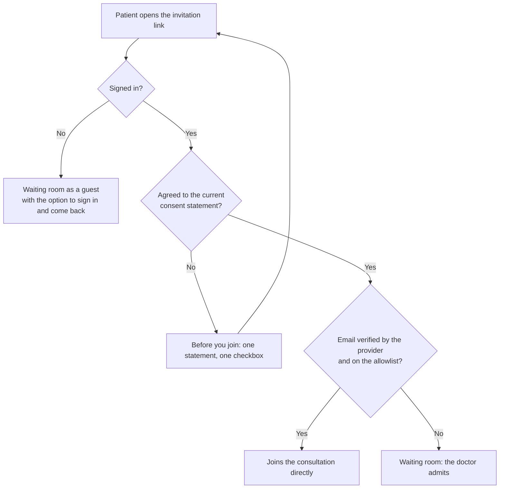

# Invitation Access Model

How a patient reaches a consultation, and why the design is shaped this way.
This complements [access-control.md](./access-control.md), which covers the
role-to-permission policy for signed-in users.

## Two different mechanisms, often confused

The system uses **two** authorization mechanisms, and conflating them causes
design mistakes:

| | Role-Based Access Control | Invitation grant |
| --- | --- | --- |
| Applies to | Signed-in doctors, patients, reviewers, admins | Anyone opening an invitation link |
| Question answered | "What may this *account* do?" | "May this *visit* enter this room?" |
| Evidence | Verified Firebase token + server-side profile role | A server-signed, expiring invitation token |
| Implemented in | `lib/auth/access-policy.ts` | `lib/invitations/validate-service.ts` |

The invitation link is a **capability**: possession of the token conveys the
grant. That is the correct pattern for inviting someone who may not yet have an
account — it is what Zoom, Google Meet, and Doxy.me use — but it means the link
itself is the secret, and **a capability cannot by itself prove who is holding
it**.

The waiting room exists precisely to close that gap: it puts a human decision
between "holds a valid link" and "enters the consultation".

## The three levels of identity

Because a link can be forwarded, the system distinguishes how a visitor's email
was established. `lib/invitations/waiting-patient-identity.ts` resolves the
strongest available source and records it as `identitySource`:

| Source | Meaning | Doctor sees |
| --- | --- | --- |
| `registered-profile` | Signed in; the email is the one the account's verified ID token states | **Registered account** |
| `invitation-token` | Email carried by an older invitation link; the visitor has not signed in | **From invitation link** |
| `self-declared` | The visitor typed the address this session | **Unverified** |
| `unidentified` | No email at all | **Unidentified guest** |

Resolution prefers the strongest source. A returning patient who reopens their
link is still recognised from their account rather than collapsing to an
anonymous entry.

**Why this matters:** the waiting queue previously showed `Email: Unknown` and
`Anonymous Patient` for returning patients, because identity was built only from
what the visitor typed in that session. The doctor was asked to admit someone
with no way to tell a returning patient from a stranger with a forwarded link.

A guest's declared address labels them for the doctor and nothing more. It is
never used to look up a profile, so a guest cannot attach their visit to someone
else's records by typing that person's email.

## Admission paths

1. **Direct** — the visitor is signed in, the identity provider has verified
   their email, and that email is on the invitation's allowlist. The patient
   joins the consultation directly.
2. **Waiting room** — everyone else. The patient holds a waiting-room-scoped
   LiveKit token only; the doctor admits or rejects.
3. **Rejected / expired / revoked** — no token is issued.

A waiting-room token grants access to `{room}-waiting`, never the consultation
room. Admission mints a new token for the consultation room. This is why an
un-admitted visitor cannot reach the call by manipulating the client.

## Admission assurance tiers

Skipping the waiting room is decided by **how strongly identity is established**,
not by an address the visitor can type. `lib/invitations/admission-policy.ts`
resolves one of four tiers and fails closed:

| Tier | Meaning | Skips the queue? |
| --- | --- | --- |
| `verified` | Signed in, non-anonymous, `email_verified` is true | **Only if also on the allowlist** |
| `authenticated` | Signed in, email not verified by the provider | No |
| `self-declared` | Typed an address this session | No |
| `anonymous` | No account, or a Firebase anonymous session | No |

This separation of *identity proofing* from *authentication* follows
[NIST SP 800-63](https://pages.nist.gov/800-63-3/sp800-63-3.html), where IAL
(proofing) and AAL (authentication) are deliberately independent: possessing a
link is neither.

**Being queued is not a rejection.** An anonymous patient loses nothing except
one click of the doctor's — which is exactly the guest/host model mainstream
video products use, and the reason the waiting room exists.

Verified behaviour, with `patient@example.com` allowlisted:

- signed in with Google as that address → joins directly
- signed in with email and password, address confirmed → joins directly
- signed in but the address not yet confirmed → waiting room
- verified but not allowlisted → waiting room
- **link holder types `patient@example.com` with no account → waiting room**
- **anonymous account asserting `patient@example.com` → waiting room**
- invitation with an empty allowlist → everyone waits

### Google or email and password: the same evidence

The policy never asks how someone signed in. `visitorIdentityFromClaims` reads
only the verified token's `email`, `email_verified`, and whether the session is
anonymous. Google confirms the address at sign-in; an email-and-password
account is confirmed when its holder opens the verification link. From then on
the two are indistinguishable to admission. That is the point: the identity
provider vouches for the address, not the button the patient pressed. A test in
`tests/security-policies.test.mjs` asserts it.

## Consent at the point of care, not registration

Until 0.2.0 a signed-in patient could be stopped by a **registration form**
before joining. It asked them to type the email their account already held,
offered an optional phone number that nothing used, and asked consent for
storing network and browser hashes on their profile. That was wrong three ways:

- **It repeated what the account had already established.** A Firebase
  account, Google or email and password, *is* a registration. Asking again
  produced a second, typed copy of the address.
- **It collected data without a use.** The phone number was stored and never
  read. Collecting only what the purpose needs is a baseline principle of
  privacy law — proportionality in the Philippine Data Privacy Act of 2012,
  data minimisation in the GDPR.
- **It asked for the wrong consent.** It covered invitation-security hashing,
  not the consultation, its optional transcription, or the summary.

It is replaced by one step, shown once per account: **Before you join**. The
statement lives in `lib/consent/telehealth-consent.ts` and says in five lines
what the consultation involves — including that transcription is optional and
asked for separately, and that summaries are deleted after the retention
window. The patient ticks one box.

The agreement is a versioned record on `users/{uid}`: `consentGiven`,
`consentGivenAt`, and `consentVersion`. Versioning has two consequences:

- `/api/patient/consent` refuses any version but the current one, so nobody is
  recorded as agreeing to words they were not shown.
- Changing the statement in substance means changing the version, and every
  patient is asked again, once. Profiles marked by the old registration form
  carry no version and are asked once for exactly this reason: what they agreed
  to was something else.

Asking at the point of care, in plain language and apart from sign-up, is the
informed-consent expectation telemedicine guidance sets for remote
consultations, and it is the privacy-by-design alternative to a consent box
bundled into account creation.

## One validation path

The invite page validates the invitation in exactly one place, and that request
always carries a freshly refreshed ID token. Agreeing to the consent statement
does not make a request of its own; it re-runs that one path.

This is the structural fix for the incident below. A second request existed,
sent after the registration form, and it did not carry the token. The server,
which trusts only a verified token for identity, correctly treated it as a
guest's. `scripts/regression-security-contracts.mjs` now fails if the page ever
contains a second call to `/api/invite/validate`.

## Signing in from the waiting room

The allowlist can only recognise someone who is signed in. A patient who opens
the link signed out, or signed in with a different account than the one the
doctor listed, used to land in the waiting room with nothing on screen to say
why. The waiting room now shows who they are signed in as and offers **sign
in**, which opens patient login with `next` set to the invitation and returns
there afterwards. Login honours `next` only for `/invite/...` paths, so the
parameter cannot become an open redirect.

## Incident: an allowlisted patient was queued (2026-09-13)

**Report.** A patient the doctor had allowlisted signed in with Google, was
shown the registration form, completed it, and was then placed in the waiting
room. The question asked was whether signing in with Google was the cause.

**What production recorded** (read-only; counts and flags only, no patient
data copied):

- The invitation carried one allowlist entry and the
  `verified-allowlist-or-doctor-admit` policy.
- Its access log held one successful access by a registered patient and **no
  allowlist violation**, so the address the server checked matched the list.
- The same patient had seven earlier direct admissions. The allowlist entry was
  never the problem.
- The queue entry was created as `doctor-manual`.

**Cause.** Two defects, one after the other:

1. The profile the server found had no recorded consent — the sign-in screens
   create profiles with `consentGiven: false` — and the validation service
   treated that as "not registered", demanding the registration form from a
   patient whose account already was a registration.
2. After the form, the page validated again **without the ID token**. With no
   verified identity the server could only treat the request as a self-declared
   guest's, and the policy, correctly, does not let a typed address skip the
   queue.

Neither step depended on Google. An email-and-password patient met the same
two.

**Fix.** The account is the registration; consent is a versioned record asked
once; there is one validation path; the waiting room offers the way to sign in.
Regression coverage: `tests/security-policies.test.mjs` (Google and password
evidence are equal; old consent is not current consent) and
`scripts/regression-security-contracts.mjs` (one validation request, which
sends the token; the consent route stores nothing but the agreement).

## Anonymous patients and account upgrade

Patients are never forced to register before a consultation. The intended
progression, which is the standard Firebase guest pattern
([best practices for anonymous authentication](https://firebase.blog/posts/2023/07/best-practices-for-anonymous-authentication/)),
is:

1. A guest opens the link and is queued as an unidentified visitor.
2. If they choose to register, `linkWithCredential` upgrades the anonymous
   account to a permanent one **keeping the same uid**, so the consultation
   history they already accumulated stays attached to them.
3. On their next invitation, that account is `verified` and an allowlist match
   lets them skip the queue.

Step 2 is why an anonymous Firebase session is worth creating for guests at all:
it gives every visit a stable identifier that a later account can inherit. Note
that linking an anonymous account means it is no longer auto-deleted by
Identity Platform's anonymous-account cleanup.

## Design rules to preserve

- **The server decides.** UI state is never the boundary; every admission path
  is re-checked server-side against the persisted invitation.
- **Fail closed.** An unknown, expired, revoked, or unmatched visitor goes to the
  waiting room — never straight into the consultation.
- **Identity comes from the token, never a lookup.** A signed-in visitor is
  `users/{uid}` for the uid their verified token names. Searching profiles by
  email is how an identity decision ends up made from someone else's record.
- **One request decides.** Every path to a consultation token goes through the
  same validation request with the same credentials; a second path is a second
  policy.
- **Ask at the point of care, once, for what is used.** Consent is versioned
  and separate from sign-up, and nothing is collected that the consultation
  does not use.
- **Show provenance, not just data.** The doctor's queue states how an identity
  was established, because admitting the wrong person is the expensive mistake.
- **Name the effect on everyone else.** Any access setting must state what
  happens to visitors it does not match, or it will be misread as stricter than
  it is.
