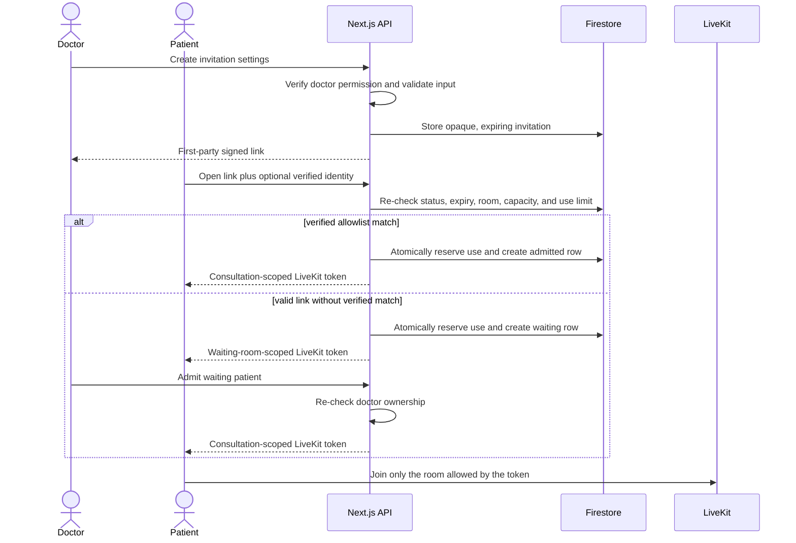

# Secure invitation flow: research, design, and gaps

This document records why the invitation flow is designed the way it is. It is
an engineering rationale for a thesis prototype, not a claim of regulatory
certification or clinical fitness.

## The selected interaction pattern

The UI follows a **Goal-Directed, object-centered invitation workbench**.
This is an application of the Goal-Directed Design approach taught in Alan
Cooper's *About Face*: begin with the doctor's goal, make the important domain
object and its state visible, keep common work in one place, disclose secondary
detail progressively, and give immediate modeless feedback. Wiley's official
[About Face, 4th Edition](https://www.wiley.com/en-us/About+Face%3A+The+Essentials+of+Interaction+Design%2C+4th+Edition-p-9781118766583)
describes Goal-Directed Design and the book's treatment of modern interaction,
mobile, and touch interfaces.

The doctor's goal is not “configure a token.” It is:

> Get the intended patient into the intended consultation at the intended time,
> while retaining a safe way to stop or review unexpected visitors.

The workbench therefore has one primary object—an invitation—with a visible
lifecycle:

```text
draft settings → active link → waiting/direct admission → used, expired, or revoked
```

The create form previews the resulting access policy before submission. Each
invitation card then exposes current state and the actions that apply to that
state: copy, inspect queue, join as doctor, or revoke. Archived records are
filtered and incrementally revealed instead of placed in a nested scroll trap.

## What proven invitation systems teach us

| Proven practice | Evidence | Decision in this app |
| --- | --- | --- |
| The link is a bearer capability, not proof of identity | OWASP recommends random, long, securely stored, single-use or expiring URL tokens for comparable reset-link flows. | Use a signed, opaque, expiring first-party `/invite/[token]` link; never treat possession as a verified patient identity. |
| Bind admission to verified identity when identity matters | Microsoft Entra B2B binds redemption to the invited identity and supports email one-time-passcode verification. GitHub requires an invited email to match a verified account email. | Only a Firebase-authenticated, email-verified account on the allowlist can skip the queue. A typed address cannot. |
| Keep a safe guest path | Mature conferencing systems use host admission/waiting-room decisions for people who cannot be strongly pre-identified. | A valid link holder who is not a verified allowlist match waits for the doctor rather than being silently trusted or permanently denied. |
| Validate authorization on every request | OWASP recommends least privilege, deny by default, and permission checks on every request. | Server routes re-check invitation status, expiry, ownership, room binding, limits, and role/permission; UI visibility is never the boundary. |
| Make time-bound authorization atomic | OWASP transaction-authorization guidance requires unique, short-lived authorization and protection against time-of-check/time-of-use races. | A Firestore transaction re-reads the invitation, reserves a use, stores its audit event, and creates a new waiting row atomically. |
| Do not put secrets or health data in logs | OWASP logging guidance says tokens, session identifiers, and sensitive personal data should be removed, masked, sanitized, hashed, or encrypted. | Tokens, transcripts, raw IP addresses, raw user agents, device fingerprints, and email allowlists are excluded from request logs. Network/browser correlation uses keyed HMAC values. |
| Make status changes perceivable without blocking work | WCAG 2.2 status-message guidance supports announcing changes without moving focus. | Copy, revoke confirmation, loading, error, and transcript states use inline/modeless feedback and accessible status or alert semantics. |
| Prepare patients before joining | HHS telehealth guidance recommends clear join instructions, technology checks, privacy expectations, and troubleshooting. | The invite page explains waiting/admission; LiveKit PreJoin checks devices; transcript capture is optional and explicit. |

Primary references:

- [OWASP Forgot Password Cheat Sheet](https://cheatsheetseries.owasp.org/cheatsheets/Forgot_Password_Cheat_Sheet.html)
- [OWASP Authorization Cheat Sheet](https://cheatsheetseries.owasp.org/cheatsheets/Authorization_Cheat_Sheet.html)
- [OWASP Transaction Authorization Cheat Sheet](https://cheatsheetseries.owasp.org/cheatsheets/Transaction_Authorization_Cheat_Sheet.html)
- [OWASP Logging Cheat Sheet](https://cheatsheetseries.owasp.org/cheatsheets/Logging_Cheat_Sheet.html)
- [NIST SP 800-63B: replay and phishing resistance](https://pages.nist.gov/800-63-4/sp800-63b/authenticators/)
- [Microsoft Entra B2B invitation redemption](https://learn.microsoft.com/en-us/entra/external-id/redemption-experience)
- [Microsoft Entra email one-time passcode](https://learn.microsoft.com/en-us/entra/external-id/one-time-passcode)
- [GitHub organization invitations](https://docs.github.com/en/enterprise-cloud@latest/organizations/managing-membership-in-your-organization/inviting-users-to-join-your-organization)
- [W3C WCAG 2.2 status messages](https://www.w3.org/WAI/WCAG22/Understanding/status-messages.html)
- [HHS: preparing patients for telehealth](https://telehealth.hhs.gov/providers/preparing-patients-for-telehealth/helping-patients-prepare-for-their-appointment)
- [HHS: telehealth privacy and security](https://telehealth.hhs.gov/providers/best-practice-guides/privacy-and-security-telehealth)

## Security model

An invitation combines three controls; none replaces the others:

1. **Capability:** a signed token proves that the holder received a link issued
   for one invitation, room, and expiry.
2. **Identity assurance:** a verified Firebase identity can prove an allowlist
   match. A self-declared email cannot.
3. **Human admission:** every visitor without that strong match receives only a
   waiting-room-scoped LiveKit token until the doctor acts.



### Privacy-preserving security signals

Device fingerprints and IP geolocation are brittle identity signals. Browsers,
private windows, VPNs, travel, carrier NAT, and assistive technology make them
change during legitimate use; fingerprinting also expands the privacy surface.
The app therefore does not use them as patient identity or a hard denial rule.

For abuse correlation, the server stores keyed HMAC values for the source
network and user-agent string. These values support “same recent anonymous
visitor” and rate-limit analysis without storing the original values. They are
not authentication factors and must never auto-admit someone.

## Link strategy

The app deliberately uses a normal HTTPS application link on its own domain.
Firebase Dynamic Links was shut down on August 25, 2025; Firebase tells projects
to migrate away from it. See the official
[Firebase Dynamic Links deprecation FAQ](https://firebase.google.com/support/dynamic-links-faq).

“Dynamic” in this app means the server can reconstruct an active signed link
from current invitation state. It does **not** mean Firebase Dynamic Links.
The token remains in the path only long enough to reach the app; pages must not
load third-party resources that could receive it through a referrer.

## LiveKit boundary

LiveKit access tokens are produced only by the backend and grant the smallest
room needed for the current state. LiveKit's official guidance says production
tokens should be generated on a backend. Webhooks are signature-verified and
treated as delivery hints rather than the only state source because LiveKit
notes that webhook delivery is retried but not guaranteed.

- [LiveKit token authentication](https://docs.livekit.io/frontends/build/authentication/)
- [LiveKit webhook events and delivery](https://docs.livekit.io/intro/basics/rooms-participants-tracks/webhooks-events/)

## Current gaps and honest boundaries

- The prototype has not had an independent penetration test, privacy impact
  assessment, clinical safety validation, or regulatory certification.
- Email verification proves control of an email account, not a legal identity.
- A doctor can still admit the wrong waiting visitor; the UI must show identity
  provenance and the defense demo must include this limitation.
- Key rotation and incident-response procedures need an operational runbook.
- Retention is partly implemented but must be approved and verified across
  Firestore, logs, backups, transcripts, and provider systems.
- LiveKit transport encryption is not the same as verified end-to-end
  encryption. Do not claim E2EE unless LiveKit E2EE is configured and tested.
- Availability still depends on Firebase, LiveKit, OpenAI, and Vercel. The call
  degrades without AI; it does not become clinically validated offline.

## Future capabilities: prepared, not shipped

### Attachments

The metadata repository and participant-scoped API boundary exist, but the API
is disabled by default with the server-only `ENABLE_FILE_ATTACHMENTS` flag and
there is no UI. Before enabling it, add object-storage upload authorization,
malware/content scanning, download authorization, retention/deletion, audit
events, and tests for cross-session denial. The AI summary must use attachment
text only after extraction reaches a trusted `ready` state.

FHIR's `DocumentReference` is useful vocabulary for metadata, status, subject,
author, and content, but using similar names is not a claim of FHIR compliance:
[HL7 FHIR DocumentReference](https://hl7.org/fhir/R4/documentreference.html).

### Scheduling

Scheduling has a reserved server capability name and is disabled by default
with `ENABLE_CONSULTATION_SCHEDULING`. No route or UI exists. A future module
should own timezone-safe start/end instants, participant references, lifecycle
states, idempotent reminders, reschedule/cancel commands, and invitation
issuance. It should not add date fields directly to invitation documents.

FHIR `Appointment` provides a proven lifecycle vocabulary worth mapping before
implementation: [HL7 FHIR Appointment](https://hl7.org/fhir/R4/appointment.html).
