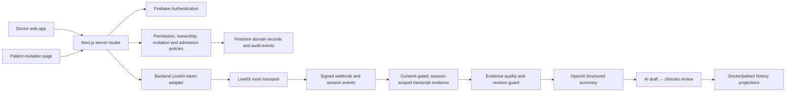

# Thesis defense guide: secure AI teleconsultation

Use this as the teaching script for the application. Start with the problem,
then show the architecture, then explain the evidence and limitations. Do not
lead with framework names.

## The thesis in one sentence

This project combines a capability-based invitation, verified identity and
human waiting-room admission, real-time teleconsultation, and a conservative
AI documentation pipeline so that convenience does not silently become access
or clinical authority.

## The three authors' contributions fit one system

| Discipline | Core question | Answer implemented here |
| --- | --- | --- |
| Cybersecurity | Who may enter, what is trusted, and what is recorded? | Signed expiring capabilities, server permissions and ownership, verified-identity tiers, waiting-room step-up, atomic use reservation, HMAC audit signals, rate limiting, revocation, retention boundaries. |
| AI/Computer Science | How can the summary be useful without inventing facts? | Session-scoped, speaker-attributed transcript evidence; evidence-quality checks; strict structured output; deterministic insufficient-evidence records; revision-aware writes; retry jobs; clinician review state. |
| Web development | How does a user understand and control all of that? | A Goal-Directed invitation workbench, explicit state controls, accessible modeless feedback, responsive LiveKit shell, device preflight, queue controls, searchable consultation history. |

The novelty is the **composition**: the link is not identity, AI is not the
clinical authority, and UI is not the security boundary. Each layer contributes
evidence or a decision without pretending to be another layer.

## System map



The deep modules are described in
[consultation-modular-architecture.md](./consultation-modular-architecture.md).

## Walk through one consultation

### 1. Doctor creates an invitation

The doctor chooses a room, expiry, waiting capacity, and optional verified
email allowlist. The server—not the form—validates the doctor permission and
room ownership. It stores an opaque invitation id and signs a token containing
the invitation id, room binding, issue time, expiry, and use mode.

Why both a stored record and a signed token? The signature prevents client
tampering; the stored record lets the doctor revoke access and lets the server
enforce current state. A valid old signature is still rejected after revocation.

### 2. Patient opens the link

The server verifies the signature and persisted invitation. It re-checks:

- invitation existence and room binding;
- active/revoked/expired state;
- expiry and use policy;
- waiting-room capacity;
- optional verified allowlist identity;
- recent active waiting/admitted entry for idempotent reconnect.

If identity is strong enough, the patient may receive a consultation token. If
not, the patient gets only a waiting-room token. A self-declared email never
grants direct entry.

### 3. Doctor admits the patient

The admit route verifies the doctor's Firebase token, permission, invitation
ownership, and waiting entry. Only then does it mint a consultation-room token.
The patient cannot change a browser field to upgrade the waiting token.

### 4. Live consultation

LiveKit carries audio, video, screen share, and chat. Tokens come from the
backend with room-scoped grants. Client state improves the interface, but the
server and token claims remain authoritative.

Transcript audio is optional and per-participant. Each participant explicitly
opts in before joining; the call works when consent is off. Short local
microphone chunks are authenticated against the consultation session,
transcribed, and discarded. Only text segments and provenance are persisted.
The older browser speech-recognition path is a labeled, clinician-started
fallback that separately requires confirmation of verbal patient consent.

### 5. AI summary

The summary generator prefers the normalized session transcript. It prepares
evidence by removing duplication, bounding size, measuring word count and
quality, and preserving speaker labels. It uses a strict JSON schema and a
prompt that forbids invention, unsupported recommendations, and “low risk” as
a default.

If evidence is absent, too sparse, or highly repetitive, deterministic code—not
the model—creates an “insufficient evidence” record. No-show and never-admitted
records are also deterministic. A transcript revision prevents a late, older
generation from overwriting a summary based on newer evidence or a clinician
edit.

The lifecycle is:

```text
processing → ready AI draft → reviewed by clinician
          ↘ failed → durable retry queue
          ↘ unavailable (configuration/entitlement)
```

AI output is decision support/documentation assistance. It is not a diagnosis,
prescription, or substitute for the clinician's source review.

## Why the UI looks this way

The selected pattern is the
[Goal-Directed, object-centered invitation workbench](./invitation-flow-design.md#the-selected-interaction-pattern).

- The primary object is the invitation, not the token string.
- The create form previews who joins directly and who waits.
- Current state is visible: active, used, expired, or revoked.
- “Sort consultations” is an explicit selected value, not a button whose label
  looks like the opposite action. This fixes the reported newest/oldest bug.
- Copy and revoke feedback is modeless and accessible.
- Secondary evidence—clinical detail, queue history, chat—is progressively
  disclosed so the main history remains scannable.
- Archived invitations use incremental “show more,” avoiding a nested scroll
  area and avoiding rendering hundreds of cards at once.

## What the production data told us

A read-only, aggregate audit was run on 2026-08-16. No raw patient names,
emails, transcripts, tokens, or message bodies were printed or copied.

| Collection | Documents observed |
| --- | ---: |
| invitations | 198 |
| waitingPatients | 139 |
| consultationSessions | 39 |
| consultations | 117 |
| calls | 100 |
| call-summaries | 14 |
| users | 23 |

Important compatibility findings:

- Only one invitation was effectively active; 78 active-status records were
  already expired by time. UI status must therefore derive effective expiry,
  not trust the stored status alone.
- Ninety-six legacy reusable invitations store `999999` as an internal
  sentinel. The UI now says “reusable until expiry” instead of presenting that
  number as a real product promise.
- All 14 summary documents predated the explicit `summaryStatus` and
  `requiresClinicianReview` fields. Read models therefore keep a compatibility
  fallback while new writes use the explicit lifecycle.
- Historical session/consultation documents do not all contain the same
  lifecycle fields. Projections normalize old and new shapes rather than
  requiring a destructive deadline-week migration.

The rule is: production-data inspection for engineering must be read-only,
aggregate, redacted, and purpose-limited. Never paste clinical records into a
prompt or log.

### Duplicate identities found on 2026-08-18

A second aggregate pass looked specifically for records describing the same
thing more than once, and found two:

| Collection | Observation |
| --- | --- |
| `users` | 4 email addresses held two profiles each; 5 profiles had no Firebase Auth account |
| `waitingPatients` | 18 redundant rows across 8 patient/invitation pairs; the worst pair held 8 rows |

Both had one cause: a key that was invented at write time instead of derived
from what already identified the record. Profiles were created with a
generated document id while every read path used the Firebase Auth uid, and a
queue entry was created per arrival rather than per patient per invitation.

This is the answer to give if a panel asks what the audit was *for*. Counting
documents is not the point; the point is that an orphaned profile still
answered `findByEmail`, so an invitation could resolve a patient to a stale uid
and role. A duplicate identity is an access-control problem before it is a
tidiness problem.

Reconciliation kept history rather than discarding it: 23 references were
repointed onto the surviving profile before its duplicate was removed, and one
orphan was deliberately kept because a record still pointed at it and no live
profile existed to merge into. See
[identity-and-record-integrity.md](./identity-and-record-integrity.md).

## Demonstration plan

1. Sign in as the doctor and create an invitation with a short expiry and no
   allowlist. Point out the live “Access preview.”
2. Copy the first-party link. Explain that it is a bearer capability and must
   be shared through a trusted channel.
3. Open it as a guest. Show that a valid link still leads to the waiting room.
4. Admit the guest as the doctor. Explain the server-issued change from a
   waiting-room token to a consultation-room token.
5. At PreJoin, leave transcription off and explain that care/video is not
   blocked by AI consent. Then opt in with synthetic demo dialogue if desired.
6. Complete the call and open consultation history. Show search, filters,
   explicit sort, evidence disclosures, and the AI-draft/review state.
7. Edit and save the draft. Show that it becomes clinician reviewed and cannot
   be overwritten by a later AI retry.
8. Revoke a second invitation and show that its signed link is refused because
   persisted state is authoritative.

Use synthetic identities and scripted non-clinical dialogue in the defense.

## Likely panel questions

### “Why not trust the email in the link or form?”

Because it is a claim, not evidence that the current holder controls that
identity. Only a verified authentication token can support direct admission;
everyone else is stepped up to the doctor's waiting-room decision.

### “Why not block a new browser, device, VPN, or country?”

Those signals change during normal patient behavior and are weak identity
evidence. Hard denial creates availability and accessibility failures. This app
uses minimal HMAC correlation for abuse analysis and keeps the human admission
step for identity uncertainty.

### “Can two simultaneous requests use the last invitation use?”

The successful use is reserved in a Firestore transaction that re-reads current
status, expiry, and use count. For a new waiting visitor, reservation, audit
event, and waiting-row creation are one atomic operation.

### “How do you know two records describe the same patient?”

By deriving the key rather than inventing one. A profile is keyed by the
Firebase Auth uid because the identity provider owns identity; a queue entry is
keyed by the invitation and the patient because that pair is what it describes.
The project got this wrong twice and the audit found it: profiles written under
a generated document id could never be matched by any sign-in, and a queue
entry created per arrival accumulated eight rows for one patient.

The security consequence matters more than the duplication. An orphaned profile
still answered a lookup by email, so an invitation could resolve a patient to a
stale account id and role — an authorization decision taken from a record that
belonged to nobody.

### “Why not just delete the duplicates?”

Because a duplicate that something still points at is not yet a duplicate. Of
five orphaned profiles, only two were safe to delete outright. Two were merged
by repointing 23 consultation and queue references onto the surviving profile,
so clinical history stayed attached to the patient. One was kept: no live
profile existed to merge into, and deleting it would have left a record
pointing at an identity that exists nowhere. Every step was dry-run first and
backed up.

### “How do you stop hallucinated summaries?”

You cannot claim zero model error. The controls reduce and expose risk:
speaker-attributed session evidence, quality gates, a conservative prompt,
strict output schema, deterministic no-evidence outcomes, revision guards,
source disclosures, and required clinician review.

### “What happens if OpenAI is down?”

The call still works. Summary state becomes failed/unavailable, the current
record is preserved, and a bounded authenticated cron worker retries durable
jobs. The UI also supports a manual retry.

### “Is this HIPAA compliant or production ready?”

Do not answer yes. Say: the prototype implements controls that support a future
compliance review, but compliance also requires contracts, configuration,
policies, risk assessment, operations, training, incident response, retention,
backup governance, and independent validation.

### “Where is professor/faculty access?”

It is prepared only in the backend policy model and remains deny-by-default.
There is no professor UI or collection-wide access. A future implementation must
require a role permission plus an active assignment to specific de-identified
consultations. See [access-control.md](./access-control.md).

### “What about file attachments and schedules?”

They are prepared as disabled capabilities, not unfinished visible features.
Attachments need secure storage, scanning, retention, and download policy;
scheduling needs a separate timezone-safe appointment lifecycle. Neither is
mixed into invitation documents or exposed in UI yet.

## Release checklist before the defense

- Run typecheck, lint, security regressions, production build, and focused E2E.
- Verify Firestore and Storage rules are deployed with the same commit.
- Verify `LIVEKIT_API_KEY`, `LIVEKIT_API_SECRET`, `OPENAI_API_KEY`,
  `CRON_SECRET`, `RATE_LIMIT_HASH_SECRET`, and
  `SECURITY_SIGNAL_HASH_SECRET` in the deployment environment.
- Keep `ENABLE_FILE_ATTACHMENTS` and `ENABLE_CONSULTATION_SCHEDULING` unset.
- Confirm the LiveKit webhook points to `/api/webhook` and rejects unsigned
  requests.
- Run the demo once with transcription off and once with consented synthetic
  speech.
- Confirm expiry, revoke, waiting admission, reconnect, summary retry, edit,
  newest-first, and oldest-first behaviors.
- Record known limitations instead of making certification claims.

## Further reading

- [Invitation research and threat model](./invitation-flow-design.md)
- [Invitation identity and admission model](./invitation-access-model.md)
- [Access control and faculty-review preparation](./access-control.md)
- [Identity and record integrity](./identity-and-record-integrity.md)
- [Production-readiness boundaries](./production-readiness.md)
- [Consultation module architecture](./consultation-modular-architecture.md)
